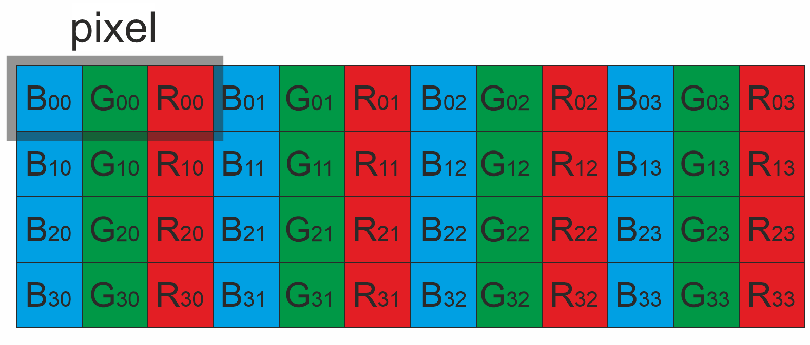

# **Frame C++ class**

**v5.0.9**


# Table of contents

- [Overview](#overview)
- [Versions](#versions)
- [Library files](#library-files)
- [Supported pixel formats](#supported-pixel-formats)
- [Frame class description](#frame-class-description)
  - [Frame class declaration](#frame-class-declaration)
  - [Default constructor](#default-constructor)
  - [Constructor with parameters](#constructor-with-parameters)
  - [Copy-constructor](#copy-constructor)
  - [getVersion method](#getversion-method)
  - [Copy operator =](#copy-operator)
  - [cloneTo method](#cloneto-method)
  - [Compare operator ==](#compare-operator-equal)
  - [Compare operator !=](#compare-operator-not-equal)
  - [release method](#release-method)
  - [serialize method](#serialize-method)
  - [deserialize method](#deserialize-method)
  - [Frame class public members](#frame-class-public-members)
- [Build and connect to your project](#build-and-connect-to-your-project)


# Overview

**Frame** class is basic class for other projects which describes video frame. Main file **Frame.h** contains declaration of **Frame** class and **Fourcc** enum which describes pixel formats supported by **Frame** class. The library doesn't have any third party dependencies. It uses C++17 standard. The library is licensed under the **Apache 2.0** license.


# Versions

**Table 1** - Library versions.

| Version | Release date | What's new                                                   |
| ------- | ------------ | ------------------------------------------------------------ |
| 1.0.0   | 08.09.2020   | First Frame class version in VideoDataStructures repository. |
| 2.0.0   | 19.11.2020   | Transformation matrix added.                                 |
| 3.0.0   | 20.12.2020   | Added NV12 pixel format.                                     |
| 4.0.0   | 20.01.2023   | - Interface changed. <br />- Added new pixel formats.<br />- Added shared_ptr for frame data.<br />- Added new methods for copy and compare data.<br />- Added new method for serialization and deserialization frame data.<br />- Tests changed. |
| 5.0.0   | 19.03.2023   | - shared_ptr replaced by normal pointer.<br />- Documentation updated. |
| 5.0.1   | 29.05.2023   | - Pixel format description (NV12 and NV21) mistake fixed.    |
| 5.0.2   | 22.06.2023   | - Added LICENSE.<br />- Repository made public.              |
| 5.0.3   | 22.06.2023   | - Added build guide.                                         |
| 5.0.4   | 06.07.2023   | - Documentation updated.                                     |
| 5.0.5   | 12.11.2023   | - Fixed errors serialization/deserialization functions.      |
| 5.0.6   | 14.12.2023   | - Memory leakage from "=" operator fixed.                    |
| 5.0.7   | 19.03.2024   | - Type of data fields changes from uint32_t to int.          |
| 5.0.8   | 16.04.2024   | - Documentation updated.<br />- Method signatures optimizes. |
| 5.0.9   | 05.07.2024   | - CMake updated.                                             |


# Library files

The library supplied by source code only. The user would be given a set of files in the form of a CMake project (repository). The repository structure is shown below:

```xml
CMakeLists.txt --------- Main CMake file of the library.
src -------------------- Folder with library source code.
    CMakeLists.txt ----- CMake file of the library.
    Frame.h ------------ Main library header file.
    FrameVersion.h ----- Header file with library version.
    FrameVersion.h.in -- CMake service file to generate version header.
    Frame.cpp ---------- C++ implementation file.
test ------------------- Folder with test application.
    CMakeLists.txt ----- CMake file of test application.
    main.cpp ----------- Source C++ file of test application.
```


# Supported pixel formats

The **Frame.h** file contains **Fourcc** enum which defines supported pixel formats. **Fourcc** enum declaration:

```cpp
/// Macro to make FOURCC code.
#define MAKE_FOURCC_CODE(a,b,c,d) ((uint32_t)(((d)<<24)|((c)<<16)|((b)<<8)|(a)))

/**
 * @brief FOURCC codes enum.
 */
enum class Fourcc
{
    /// RGB 24bit pixel format.
    /// https://docs.kernel.org/userspace-api/media/v4l/pixfmt-rgb.html#v4l2-pix-fmt-rgb24
    RGB24 = MAKE_FOURCC_CODE('R', 'G', 'B', '3'),
    /// BGR 24bit pixel format.
    /// https://docs.kernel.org/userspace-api/media/v4l/pixfmt-rgb.html#v4l2-pix-fmt-bgr24
    BGR24 = MAKE_FOURCC_CODE('B', 'G', 'R', '3'),
    /// YUYV 16bits per pixel format.
    /// https://docs.kernel.org/userspace-api/media/v4l/pixfmt-packed-yuv.html#v4l2-pix-fmt-yuyv
    YUYV  = MAKE_FOURCC_CODE('Y', 'U', 'Y', 'V'),
    /// UYVY 16bits per pixel format.
    /// https://docs.kernel.org/userspace-api/media/v4l/pixfmt-packed-yuv.html#v4l2-pix-fmt-vyuy
    UYVY  = MAKE_FOURCC_CODE('U', 'Y', 'V', 'Y'),
    /// Grayscale 8bit.
    /// https://docs.kernel.org/userspace-api/media/v4l/pixfmt-yuv-luma.html#v4l2-pix-fmt-grey
    GRAY  = MAKE_FOURCC_CODE('G', 'R', 'A', 'Y'),
    /// YUV 24bit per pixel format.
    /// https://docs.kernel.org/userspace-api/media/v4l/pixfmt-packed-yuv.html#v4l2-pix-fmt-yuv24
    YUV24  = MAKE_FOURCC_CODE('Y', 'U', 'V', '3'),
    /// NV12 pixel format.
    /// https://docs.kernel.org/userspace-api/media/v4l/pixfmt-yuv-planar.html#v4l2-pix-fmt-nv12
    NV12  = MAKE_FOURCC_CODE('N', 'V', '1', '2'),
    /// NV21 pixel format.
    /// https://docs.kernel.org/userspace-api/media/v4l/pixfmt-yuv-planar.html#v4l2-pix-fmt-nv21
    NV21  = MAKE_FOURCC_CODE('N', 'V', '2', '1'),
    /// YU12 (YUV420) - Planar pixel format.
    /// https://docs.kernel.org/userspace-api/media/v4l/pixfmt-yuv-planar.html#v4l2-pix-fmt-yuv420
    YU12 = MAKE_FOURCC_CODE('Y', 'U', '1', '2'),
    /// YV12 (YVU420) - Planar pixel format.
    /// https://docs.kernel.org/userspace-api/media/v4l/pixfmt-yuv-planar.html#v4l2-pix-fmt-yuv420
    YV12 = MAKE_FOURCC_CODE('Y', 'V', '1', '2'),
    /// JPEG compressed format.
    /// https://docs.kernel.org/userspace-api/media/v4l/pixfmt-compressed.html#v4l2-pix-fmt-jpeg
    JPEG  = MAKE_FOURCC_CODE('J', 'P', 'E', 'G'),
    /// H264 compressed format.
    /// https://docs.kernel.org/userspace-api/media/v4l/pixfmt-compressed.html#v4l2-pix-fmt-h264
    H264  = MAKE_FOURCC_CODE('H', '2', '6', '4'),
    /// HEVC compressed format.
    /// https://docs.kernel.org/userspace-api/media/v4l/pixfmt-compressed.html#v4l2-pix-fmt-hevc
    HEVC  = MAKE_FOURCC_CODE('H', 'E', 'V', 'C')
};
```

**Table 2** - Bytes layout of supported pixel formats. Example of 4x4 pixels image.

| RGB24      | BGR24      |
| ---------------------------------------------- | ---------------------------------------------- |
| **YUV24** | **GRAY** |
| **YUYV** | **UYVY** |
| **NV12** | **NV21** |
| **YU12** | **YV12** |


# Frame class description


## Frame class declaration

**Frame.h** file contains **Frame** class declaration. Frame class declaration:

```cpp
namespace cr
{
namespace video
{
class Frame
{
public:

    /// Get string of current class version.
    static std::string getVersion();

    /// Default class constructor.
    Frame();

    /// Class constructor with parameters.
    Frame(int width, int height, Fourcc fourcc, int size = 0, uint8_t* data = nullptr);

    /// Copy class constructor.
    Frame(Frame& src);

    /// Class destructor.
    ~Frame();

    /// Operator "=". Operator makes full copy of data.
    Frame& operator= (const Frame& src);

    /// Operator "!=". Operator to compare two frame objects.
    bool operator!= (Frame& src);

    /// Operator "==". Operator to compare two frame objects.
    bool operator== (Frame& src);

    /// Clone data. Method copies frame and copy just pointer to data.
    void cloneTo(Frame& dst);

    /// Release frame memory.
    void release();

    /// Serialize frame data.
    void serialize(uint8_t* data, int& size);

    /// Deserialize data to frame object.
    bool deserialize(uint8_t* data, int size);

    /// Frame width (pixels).
    int width{0};
    /// Frame height (pixels).
    int height{0};
    /// FOURCC code of data format.
    Fourcc fourcc{Fourcc::YUV24};
    /// Frame data size (bytes).
    int size{0};
    /// ID of frame.
    int frameId{0};
    /// ID of video source.
    int sourceId{0};
    /// Pointer to frame data.
    uint8_t* data{nullptr};
};
}
}
```


## Default constructor

Default Frame class constructor does nothing. It doesn't allocate memory. Constructor declaration:

```cpp
Frame();
```


## Constructor with parameters

Constructor with parameters allocates memory and initializes Frame attributes (size, pixels format etc.). By default allocated memory filled by 0 but if user provides pointer to frame data it will be copied to internal frame buffer. Constructor declaration:

```cpp
Frame(int width, int height, Fourcc fourcc, int size = 0, uint8_t* data = nullptr);
```

| Parameter | Description                                                  |
| --------- | ------------------------------------------------------------ |
| width     | Frame width. Must be > 0.                                    |
| height    | Frame height. Must be > 0.                                   |
| fourcc    | Pixel format according to [Fourcc](#supported-pixel-formats) enum. |
| size      | Optional parameter. Size of external frame data. If user wants to initialize frame data from another buffer it can be done by initializing parameter **size** and **data**. |
| data      | Optional parameter. Pointer to external frame data to be copied. |

Example of frame initialization:

```cpp
// Frame filled by 0.
cr::video::Frame image1(640, 480, cr::video::Fourcc::RGB24);

// Copy.
cr::video::Frame image2 = cr::video::Frame(640, 480, cr::video::Fourcc::YUV24);

// Init by external data. Data will be copied.
cr::video::Frame image3(640, 480, cr::video::Fourcc::BGR24, 921600, externalDataBuffer);

// Init frame attributes manually.
Frame image4;
image4.data = externalDataBuffer;
image4.width = 640;
image4.height = 480;
image4.size = image4.width * image4.height * 3;
image4.fourcc = cr::video::Fourcc::BGR24;

// Dynamic allocation.
cr::video::Frame* image5 = new cr::video::Frame(640, 480, cr::video::Fourcc::YUV24);
```


## Copy-constructor

Copy constructor copy frame data from other Frame class instance. Constructor declaration:

```cpp
Frame(Frame& src);
```

Example of frame initialization:

```cpp
// Frame filled by 0.
cr::video::Frame image1(640, 480, cr::video::Fourcc::RGB24);

// Copy-constructor.
cr::video::Frame image2(image1);

// Copy-constructor.
cr::video::Frame image3 = cr::video::Frame(image1);
```


## getVersion method

The **getVersion()** method returns string of current version of **Frame** class. Method declaration:

```cpp
static std::string getVersion();
```

Method can be used without **Frame** class instance. Example:

```cpp
std::cout << "Frame class version: " << cr::video::Frame::getVersion() << std::endl;
```

Console output:

```bash
Frame class version: 5.0.9
```


## Copy operator

Copy operator **"="** intended to full copy of frame data. Operator copies frame data and frame attributes. Operator declaration:

```cpp
Frame& operator= (const Frame& src);
```

Example:

```cpp
// Frame filled by 0.
cr::video::Frame image1(640, 480, cr::video::Fourcc::RGB24);

// Make copy.
cr::video::Frame image2 = image1;
```


## cloneTo method

The **cloneTo(...)** method designed to clone frame object without copy of data. Method copies frame attributes and initialize pointer to frame data without copy of data. Method declaration:

```cpp
void cloneTo(Frame& dst);
```

| Parameter | Description                                                  |
| --------- | ------------------------------------------------------------ |
| dst       | Frame object for initialization. Method initialize only frame attributes and copies pointer to frame data. |

Example:

```cpp
// Frame filled by 0.
cr::video::Frame image1(640, 480, cr::video::Fourcc::RGB24);

// Clone.
cr::video::Frame image2;
image1.cloneTo(image2);
```


## Compare operator equal

Compare operator **"=="** compares data attributes and frame data of to Frame objects. Operator declaration:

```cpp
bool operator== (Frame& src);
```

**Returns:** TRUE if all attributes and data of two Frame objects are identical (or when comparing an object to itself) or FALSE if not.

Example:

```cpp
// Frame filled by 0.
cr::video::Frame image1(640, 480, cr::video::Fourcc::RGB24);
cr::video::Frame image2(640, 480, cr::video::Fourcc::RGB24);

// Compare.
if (image1 == image2)
    std::cout << "Identical" << std::endl;

// Change data.
image1.data[0] = rand() % 255;

// Compare.
if (image1 == image2)
    std::cout << "Identical" << std::endl;
else
    std::cout << "Not identical" << std::endl;
```


## Compare operator not equal

Compare operator **"!="** compares data attributes and frame data of to Frame objects. Operator declaration:

```cpp
bool operator!= (Frame& src);
```

**Returns:** TRUE if all attributes and data of two Frame objects are identical (or when comparing an object to itself) or FALSE if not.

Example:

```cpp
// Frame filled by 0.
cr::video::Frame image1(640, 480, cr::video::Fourcc::RGB24);
cr::video::Frame image2(640, 480, cr::video::Fourcc::RGB24);

// Compare.
if (image1 != image2)
    std::cout << "Not identical" << std::endl;
else
    std::cout << "Identical"

// Change data.
image1.data[0] = rand() % 255;

// Compare.
if (image1 != image2)
    std::cout << "Not identical" << std::endl;
else
    std::cout << "Identical" << std::endl;
```


## release method

The **release()** method intended to release allocated memory and reset frame attributes. Method declaration:

```cpp
void release();
```

Example:

```cpp
// Create Frame object with memory allocation.
cr::video::Frame image1(640, 480, cr::video::Fourcc::RGB24);

// Release Frame object.
image1.release();
```


## serialize method

The **serialize(...)** method intended for serialization of Frame object with data. Sometimes the user needs to serialize an object in order to transfer or write it somewhere. Method declaration:

```cpp
void serialize(uint8_t* data, int& size);
```

| Parameter | Description              |
| --------- | ------------------------ |
| data      | Pointer to data buffer.  |
| size      | Size of serialized data. |

Example:

```cpp
// Init frames.
Frame srcFrame(640, 480, Fourcc::BGR24);

// Fill source frame.
for (uint32_t i = 0; i < srcFrame.size; ++i)
     srcFrame.data[i] = (uint8_t)(rand() % 255);

// Serialize data.
uint8_t* data = new uint8_t[1920 * 1080 * 4];
int size = 0;
srcFrame.serialize(data, size);
```


## deserialize method

The **deserialize(...)** method intended for deserialization of Frame object. Method declaration:

```cpp
bool deserialize(uint8_t* data, int size);
```

| Parameter | Description              |
| --------- | ------------------------ |
| data      | Pointer to data buffer.  |
| size      | Size of serialized data. |

**Returns:** TRUE of the data deserialized or FALSE if not.

Example:

```cpp
// Init frames.
Frame srcFrame(640, 480, Fourcc::BGR24);
Frame dstFrame(1280, 720, Fourcc::YUV24);

// Fill source frame.
for (uint32_t i = 0; i < srcFrame.size; ++i)
     srcFrame.data[i] = (uint8_t)(rand() % 255);

// Serialize data.
uint8_t* data = new uint8_t[1920 * 1080 * 4];
int size = 0;
srcFrame.serialize(data, size);

// Deserialize data.
if (!dstFrame.deserialize(data, size))
{
    std::cout << "Data not deserialized" << std::endl;
    return false;
}

// Compare atributes.
if (srcFrame.size != dstFrame.size)
{
    std::cout << "[" << __LINE__ << "] " << __FILE__ << " : ERROR" << std::endl;
    return false;
}
if (srcFrame.width != dstFrame.width)
{
    std::cout << "[" << __LINE__ << "] " << __FILE__ << " : ERROR" << std::endl;
    return false;
}
if (srcFrame.height != dstFrame.height)
{
    std::cout << "[" << __LINE__ << "] " << __FILE__ << " : ERROR" << std::endl;
    return false;
}
if (srcFrame.fourcc != dstFrame.fourcc)
{
    std::cout << "[" << __LINE__ << "] " << __FILE__ << " : ERROR" << std::endl;
    return false;
}
if (srcFrame.sourceId != dstFrame.sourceId)
{
    cout << "[" << __LINE__ << "] " << __FILE__ << " : ERROR" << std::endl;
    return false;
}
if (srcFrame.frameId != dstFrame.frameId)
{
    std::cout << "[" << __LINE__ << "] " << __FILE__ << " : ERROR" << std::endl;
    return false;
}

// Compare frame data.
for (uint32_t i = 0; i < srcFrame.size; ++i)
{
    if (srcFrame.data[i] != dstFrame.data[i])
    {
        std::cout << "[" << __LINE__ << "] " << __FILE__ << " : ERROR" << std::endl;
        return false;
    }
}
```


## Frame class public members

Frame class public members declaration:

```cpp
/// Frame width (pixels).
uint32_t width{0};
/// Frame height (pixels).
uint32_t height{0};
/// FOURCC code of data format.
Fourcc fourcc{Fourcc::YUV24};
/// Frame data size (bytes).
uint32_t size{0};
/// ID of frame.
uint32_t frameId{0};
/// ID of video source.
uint32_t sourceId{0};
/// Pointer to frame data.
uint8_t* data{nullptr};
```

**Table 3** - Frame class public members.

| Field    | Description                                                  |
| -------- | ------------------------------------------------------------ |
| width    | Frame width.                                                 |
| height   | Frame height.                                                |
| fourcc   | Fourcc code according to [Fourcc](#supported-pixel-formats) enum declared in **Frame.h** file. |
| size     | Size of frame data.                                          |
| frameId  | Frame ID. User defines this filed.                           |
| sourceId | Source ID. User defines this field.                          |
| data     | Pointer to frame data.                                       |


# Build and connect to your project

Typical commands to build **Frame** library:

```bash
git clone https://github.com/ConstantRobotics-Ltd/Frame.git
cd Frame
mkdir build
cd build
cmake ..
make
```

If you want connect Frame library to your CMake project as source code you can make follow. For example, if your repository has structure:

```bash
CMakeLists.txt
src
    CMakeList.txt
    yourLib.h
    yourLib.cpp
```

You can add repository **Frame** as submodule by command:

```bash
cd <your repository folder>
git submodule add https://github.com/ConstantRobotics-Ltd/Frame.git 3rdparty/Frame
```

In you repository folder will be created folder **3rdparty/Frame** which contains files of **Frame** repository. Or you can copy **Frame** repository folder directly to **3rdparty** folder of your repository. New structure of your repository:

```bash
CMakeLists.txt
src
    CMakeList.txt
    yourLib.h
    yourLib.cpp
3rdparty
    Frame
```

Create CMakeLists.txt file in **3rdparty** folder. CMakeLists.txt should contain:

```cmake
cmake_minimum_required(VERSION 3.13)

################################################################################
## 3RD-PARTY
## dependencies for the project
################################################################################
project(3rdparty LANGUAGES CXX)

################################################################################
## SETTINGS
## basic 3rd-party settings before use
################################################################################
# To inherit the top-level architecture when the project is used as a submodule.
SET(PARENT ${PARENT}_YOUR_PROJECT_3RDPARTY)
# Disable self-overwriting of parameters inside included subdirectories.
SET(${PARENT}_SUBMODULE_CACHE_OVERWRITE OFF CACHE BOOL "" FORCE)

################################################################################
## CONFIGURATION
## 3rd-party submodules configuration
################################################################################
SET(${PARENT}_SUBMODULE_FRAME                           ON  CACHE BOOL "" FORCE)
if (${PARENT}_SUBMODULE_FRAME)
    SET(${PARENT}_FRAME                                 ON  CACHE BOOL "" FORCE)
    SET(${PARENT}_FRAME_TEST                            OFF CACHE BOOL "" FORCE)
endif()

################################################################################
## INCLUDING SUBDIRECTORIES
## Adding subdirectories according to the 3rd-party configuration
################################################################################
if (${PARENT}_SUBMODULE_FRAME)
    add_subdirectory(Frame)
endif()
```

File **3rdparty/CMakeLists.txt** adds folder **Frame** to your project and excludes test application (Frame class tests) from compiling (by default test application excluded from compiling if **Frame** repository used as sub-repository). Your repository new structure will be:

```bash
CMakeLists.txt
src
    CMakeList.txt
    yourLib.h
    yourLib.cpp
3rdparty
    CMakeLists.txt
    Frame
```

Next you need include folder 3rdparty in main **CMakeLists.txt** file of your repository. Add string at the end of your main **CMakeLists.txt**:

```cmake
add_subdirectory(3rdparty)
```

Next you have to include Frame library in your **src/CMakeLists.txt** file:

```cmake
target_link_libraries(${PROJECT_NAME} Frame)
```

Done!